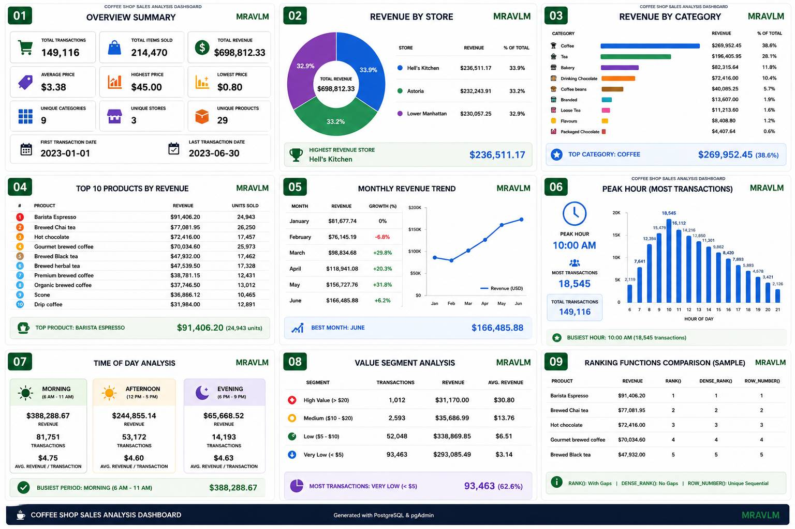
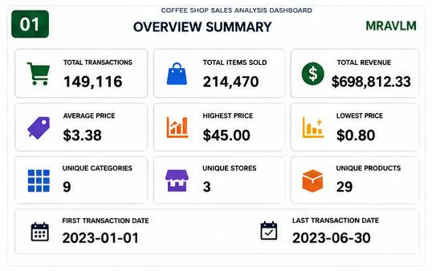

# ☕ Coffee Shop Sales Analysis - SQL Project


---

##  Complete Dashboard



> *Complete dashboard showing all key metrics at a glance*

---

##  Quick Overview

| Metric | Value |
|--------|-------|
| **Total Revenue** | $698,812.33 |
| **Total Transactions** | 149,116 |
| **Total Items Sold** | 214,470 |
| **Time Period** | Jan 2023 - Jun 2023 |
| **Stores** | 3 Locations |
| **Products** | 29 Unique Items |

---

## 📈 Key Insights at a Glance

### 🏆 Top Performers

| Category | Winner | Value |
|----------|--------|-------|
| **Top Store** | Hell's Kitchen | $236,511.17 |
| **Top Category** | Coffee | $269,952.45 (38.6%) |
| **Top Product** | Barista Espresso | $91,406.20 |
| **Peak Hour** | 10:00 AM | 18,545 transactions |
| **Best Month** | June | $166,485.88 |

### 📊 Growth Metrics

- **Revenue Growth (Jan-Jun):** +103.8%
- **Best Month-over-Month:** May (+31.8%)
- **Average Transaction Value:** $4.69
- **Total Units Sold:** 214,470

---

## 📸 Dashboard Sections

### 1. Overview Summary


### 2. Revenue by Store


### 3. Revenue by Category


### 4. Top Products


### 5. Monthly Revenue Trend


### 6. Peak Hours


### 7. Time of Day Analysis


### 8. Value Segment Analysis


### 9. Ranking Functions Comparison


---

## ⏰ Time Analysis

| Period | Revenue | Transactions | Avg. Value |
|--------|---------|--------------|------------|
| 🌅 Morning (6-11 AM) | $388,288.67 | 81,751 | $4.75 |
| ☀️ Afternoon (12-5 PM) | $244,855.14 | 53,172 | $4.60 |
|  Evening (6-9 PM) | $65,668.52 | 14,193 | $4.63 |

**💡 Insight:** Morning generates **55.6%** of total revenue

---

## 💰 Transaction Value Analysis

| Segment | Transactions | Revenue | Avg. Value |
|---------|--------------|---------|------------|
| 💎 High Value (>$20) | 1,012 | $31,170.00 | $30.80 |
| 💰 Medium ($10-20) | 2,593 | $35,686.99 | $13.76 |
| 💵 Low ($5-10) | 52,048 | $338,869.85 | $6.51 |
|  Very Low (<$5) | 93,463 | $293,085.49 | $3.14 |

**💡 Insight:** 62.6% of transactions are under $5

---

##  Actionable Recommendations

### 1. Morning Rush Strategy
- Maximize staffing 8-11 AM
- Launch "Morning Combo" deals
- Promote quick-service items

### 2. Product Strategy
- Feature Barista Espresso prominently
- Bundle Coffee + Bakery items
- Highlight Chai tea for tea lovers

### 3. Customer Value
- Create upselling training for staff
- Loyalty program for frequent buyers
- Premium product promotions

### 4. Growth Opportunities
- Extend evening hours (6-9 PM)
- Promote hot chocolate in evenings
- Seasonal specials to boost sales

---

## 🛠️ SQL Skills Demonstrated

### Core Skills
✅ Data Cleaning & Validation  
✅ Aggregations (SUM, AVG, COUNT)  
✅ GROUP BY & HAVING  
✅ CASE Statements  
✅ Subqueries  

### Advanced SQL
✅ Common Table Expressions (CTEs)  
✅ Window Functions (RANK, DENSE_RANK, ROW_NUMBER)  
✅ LAG/LEAD (Trend Analysis)  
✅ PARTITION BY (Category Analysis)  
✅ Date/Time Functions (EXTRACT, DATE_TRUNC)  

---

##  Project Structure

```
coffee-shop-sales-sql-analysis/
│
├── README.md                    # Project documentation
├── LICENSE                      # MIT License
├── .gitignore                   # Git ignore rules
│
├── data/
│   └── coffee_shop_sales.csv    # Raw dataset
│
├── sql/
│   ├── 01_create_table.sql      # Table creation
│   ├── 02_data_cleaning.sql     # Data validation
│   ├── 03_data_exploration.sql  # Summary stats
│   ├── 04_business_analysis.sql # Business metrics
│   ├── 05_subqueries.sql        # Subquery examples
│   ├── 06_cte.sql               # CTE examples
│   └── 07_window_functions.sql  # Window functions
│
├── results/
│   ├── insights.md              # Key findings
│   └── query_results.md         # Query outputs
│
── images/
│   ├── Analysis_Dashboard.png   # Complete dashboard
│   ├── 01_overview.png
│   ├── 02_revenue_by_stor.png
│   ├── 03_revenue_by_category.png
│   ├── 04_top_products.png
│   ├── 05_monthly_revenue.png
│   ├── 06_peak_hours.png
│   ├── 07_time_of_day.png
│   ├── 08_value_segments.png
│   └── 09_ranking_functions.png
│
└── docs/
    └── project_notes.md         # Personal notes
```

---

## 🚀 How to Run This Project

### 1. Clone Repository
```bash
git clone https://github.com/MRAVLM/coffee-shop-sales-sql-analysis.git
cd coffee-shop-sales-sql-analysis
```

### 2. Import Data
```bash
psql -U your_username -d your_database -c "\copy coffee_shop_sales FROM 'data/coffee_shop_sales.csv' DELIMITER ',' CSV HEADER;"
```

### 3. Run SQL Scripts in Order
```bash
psql -U your_username -d your_database -f sql/01_create_table.sql
psql -U your_username -d your_database -f sql/02_data_cleaning.sql
psql -U your_username -d your_database -f sql/03_data_exploration.sql
psql -U your_username -d your_database -f sql/04_business_analysis.sql
psql -U your_username -d your_database -f sql/05_subqueries.sql
psql -U your_username -d your_database -f sql/06_cte.sql
psql -U your_username -d your_database -f sql/07_window_functions.sql
```

---

## 👨‍💻 About the Author

Hi! I'm **Amirali Marjani(MRAVLM)**, an aspiring Data Analyst currently building my skills in SQL, Python, and Data Visualization. 

This project represents **10+ hours** of dedicated work and demonstrates my ability to:
- Write clean, efficient SQL queries
- Perform rigorous data cleaning and validation
- Extract actionable business insights from raw data
- Create professional dashboards and documentation

I'm actively looking for **Junior Data Analyst** roles where I can contribute, learn, and grow.

---

## 📫 Connect with Me

- 🔗 **LinkedIn:** [linkedin.com/in/Amirali-Marjani](https://linkedin.com/in/Amirali-Marjani)
- 🐙 **GitHub:** [github.com/MRAVLM](https://github.com/MRAVLM)
- 📧 **Email:** Amiralimarjany@gmail.com

*Feel free to reach out for collaboration, feedback, or opportunities!*

---

## 🙏 Acknowledgments

- Dataset sourced from publicly available community datasets
- Inspired by real-world coffee shop analytics and business intelligence practices
- Built as a core part of my data analysis portfolio

---

⭐ *Star this repo if you found it helpful!*

