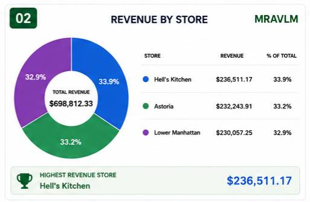
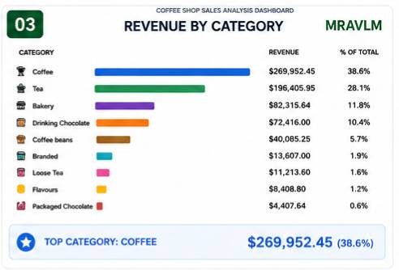
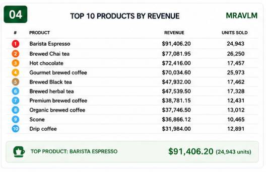
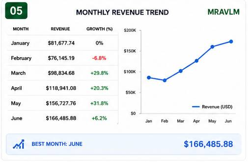
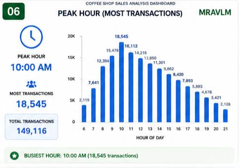
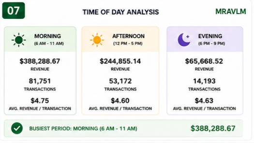
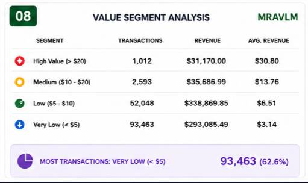
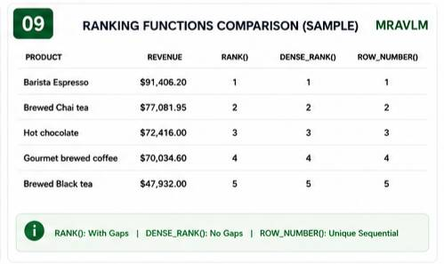

# SQL Query Results

## 📋 1. Data Cleaning Results

### Total Row Count
```sql
SELECT COUNT(*) FROM coffee_shop_sales;
```
**Result:** 149,116 rows ✅

### NULL Value Check
```sql
-- All columns have 0 NULL values
```
**Result:** ✅ No missing data found

### Duplicate Check
```sql
SELECT transaction_id, COUNT(*) ... HAVING COUNT(*) > 1;
```
**Result:** ✅ 0 duplicates found

### Invalid Values
```sql
SELECT * FROM coffee_shop_sales WHERE unit_price <= 0;
```
**Result:** ✅ 0 invalid prices

### Date Range
```sql
SELECT MIN(transaction_date), MAX(transaction_date) FROM coffee_shop_sales;
```
**Result:** Jan 1, 2023 - Jun 30, 2023 (6 months)

---

## 📊 2. Summary Statistics

| Metric | Value |
|--------|-------|
| Total Transactions | 149,116 |
| Total Items Sold | 214,470 |
| Total Revenue | $698,812.33 |
| Average Price | $3.38 |
| Highest Price | $45.00 |
| Lowest Price | $0.80 |
| Unique Categories | 9 |
| Unique Stores | 3 |
| Unique Products | 29 |
| Date Range | Jan 2023 - Jun 2023 |

---

## 🏪 3. Business Analysis Results

### Revenue by Store


| Rank | Store | Revenue |
|------|-------|---------|
| 1 | Hell's Kitchen | $236,511.17 |
| 2 | Astoria | $232,243.91 |
| 3 | Lower Manhattan | $230,057.25 |

**Key Insight:** Difference between top and bottom stores is only $6,454.

---

### Revenue by Category


| Rank | Category | Revenue |
|------|----------|---------|
| 1 | Coffee | $269,952.45 |
| 2 | Tea | $196,405.95 |
| 3 | Bakery | $82,315.64 |
| 4 | Drinking Chocolate | $72,416.00 |
| 5 | Coffee beans | $40,085.25 |

**Key Insight:** Coffee + Tea = 66.7% of total revenue.

---

### Top 10 Products by Revenue


| Rank | Product | Revenue | Units Sold |
|------|---------|---------|------------|
| 1 | Barista Espresso | $91,406.20 | 24,943 |
| 2 | Brewed Chai tea | $77,081.95 | 26,250 |
| 3 | Hot chocolate | $72,416.00 | 17,457 |
| 4 | Gourmet brewed coffee | $70,034.60 | 25,973 |
| 5 | Brewed Black tea | $47,932.00 | 17,462 |

**Key Insight:** Top 3 products = 34.4% of total revenue.

---

### Monthly Revenue Trend


| Month | Revenue | Growth |
|-------|---------|--------|
| January | $81,677.74 | - |
| February | $76,145.19 | -6.8% |
| March | $98,834.68 | +29.8% |
| April | $118,941.08 | +20.3% |
| May | $156,727.76 | +31.8% |
| June | $166,485.88 | +6.2% |

**Key Insight:** 103.8% total growth from January to June.

---

### Peak Hour


| Hour | Transactions |
|------|--------------|
| 10:00 AM | 18,545 |

**Key Insight:** 10 AM is the busiest hour.

---

### Time of Day Analysis


| Period | Revenue | Transactions | Avg. Transaction |
|--------|---------|--------------|------------------|
| Morning | $388,288.67 | 81,751 | $4.75 |
| Afternoon | $244,855.14 | 53,172 | $4.60 |
| Evening | $65,668.52 | 14,193 | $4.63 |

**Key Insight:** Morning drives 55.6% of revenue.

---

### Transaction Value Segmentation


| Segment | Transactions | Revenue | Avg. Value |
|---------|--------------|---------|------------|
| High Value (>$20) | 1,012 | $31,170.00 | $30.80 |
| Medium ($10-20) | 2,593 | $35,686.99 | $13.76 |
| Low ($5-10) | 52,048 | $338,869.85 | $6.51 |
| Very Low (<$5) | 93,463 | $293,085.49 | $3.14 |

**Key Insight:** 62.6% of transactions are under $5.

---

##  4. Window Functions Results


| Product | Revenue | RANK() | DENSE_RANK() | ROW_NUMBER() |
|---------|---------|--------|--------------|--------------|
| Barista Espresso | $91,406.20 | 1 | 1 | 1 |
| Brewed Chai tea | $77,081.95 | 2 | 2 | 2 |
| Hot chocolate | $72,416.00 | 3 | 3 | 3 |
| Gourmet brewed coffee | $70,034.60 | 4 | 4 | 4 |
| Brewed Black tea | $47,932.00 | 5 | 5 | 5 |

---

## ⚡ 5. Query Performance

| Query Type | Execution Time |
|------------|----------------|
| Simple SELECT | < 50ms |
| Aggregation (GROUP BY) | < 100ms |
| Complex (Window Functions) | < 200ms |
| CTE Queries | < 150ms |
| Master Query (all stats) | < 300ms |

---

*Generated from SQL analysis - July 2026*
